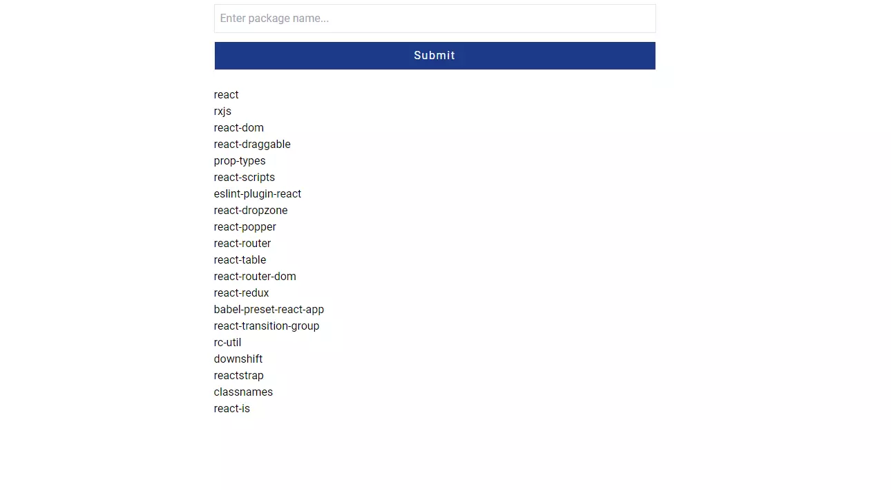

# package-search

## View the project live [here.](https://package-search.netlify.app/)

This project uses React with TypeScript and Redux to search the NPM Registry
for any package names typed in the search field. If packages are found, they are
displayed in a list below the form. The project makes use of Redux to keep
track of state. Styling is handled via Tailwind CSS.



## Installation Instructions

1. Clone the repo:

```sh
git clone https://github.com/xiraynedev/package-search.git
```

2. Change directory:

```sh
cd package-search
```

3. Install packages:

```sh
npm i
```

4. Start the dev server:

```sh
npm run dev
```
